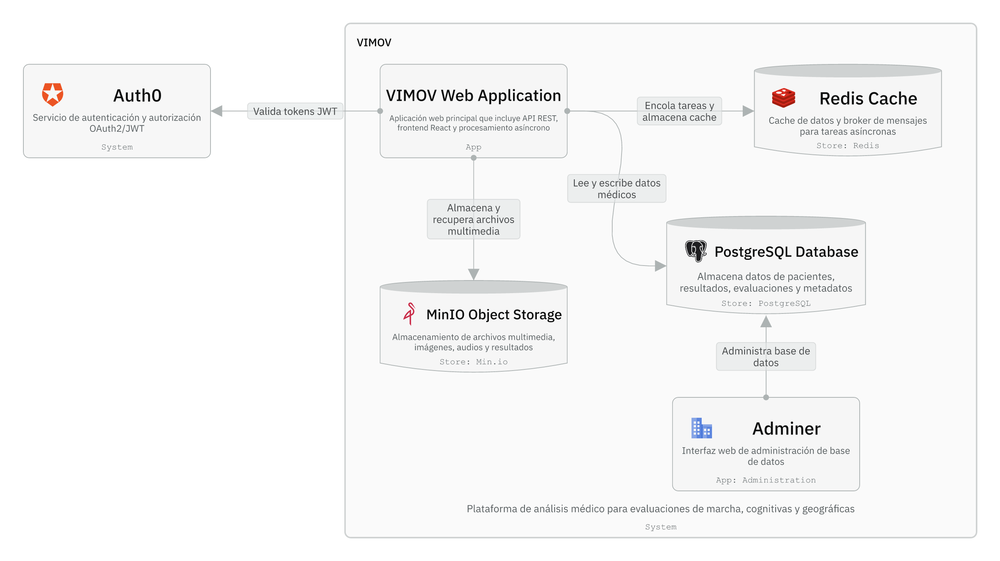

# 🏗️ Arquitectura Base - Imágenes Reales

## Cambios Realizados

Se acomodaron las slides de arquitectura para utilizar imágenes reales en lugar de placeholders.

## ✅ Imagen Convertida

### Slide 26 - ANÁLISIS DE LA ARQUITECTURA BASE

**Antes (Placeholder):**
```html
<div class="img-placeholder">
    <div class="ip-label">Modelo C4 Nivel 2 — Vimov</div>
    <div class="ip-filename">assets/c4-nivel2-vimov.png</div>
</div>
```
❌ Solo mostraba texto, sin la imagen real

**Después (Imagen Real):**
```html

```
✅ Ahora muestra la imagen real de la arquitectura C4 Nivel 2

---

## 📊 Ubicación en la Presentación

**Slide 26**: ANÁLISIS DE LA ARQUITECTURA BASE
- **Sección izquierda**: Arquitectura Vimov
  - Lista de diagramas (C4 niveles 1, 2, 3 + MER)
  - **Imagen**: Modelo C4 Nivel 2 — Vimov (250px alto)
  
- **Sección derecha**: Aplicación Móvil IMUs
  - Lista de diagramas (clases, secuencia, flujo datos)
  - Placeholder (en gris) para "Diagrama de Flujo de Datos — IMUs App"

---

## 📁 Imágenes Disponibles

| Archivo | Estado | Ubicación |
|---------|--------|-----------|
| `c4-nivel2-vimov.png` | ✅ ACTIVA | Slide 26 - Arquitectura Vimov |
| `confusion-pronacion.png` | ✅ ACTIVA | Slide 23 - Matriz Pronación |
| `confusion-golpeteo.png` | ✅ ACTIVA | Slide 25 - Matriz Golpeteo |
| `logo-icesi.png` | ✅ ACTIVA | Todas las slides (header) |
| `flujo-datos-imus.png` | ⚠️ FALTA | Slide 26 - IMUs App (placeholder) |
| `tech-vimov.png` | ⚠️ FALTA | Slide 27 - Tecnologías Vimov |
| `tech-imus.png` | ⚠️ FALTA | Slide 27 - Tecnologías IMUs |

---

## 🎨 Especificaciones de la Imagen

**c4-nivel2-vimov.png:**
- Altura máxima: 250px
- Ancho: 100% (responsive)
- Border-radius: 10px (esquinas redondeadas)
- Sombra: 0 4px 20px rgba(0,0,0,0.08)
- Borde: 1px solid var(--border)

---

## 🔄 Cómo Funcionan Ahora las Imágenes

### Sistema de Imágenes Real

**En la slide 26**, la sección izquierda ahora muestra:

1. **Título**: "Arquitectura Vimov"
2. **Lista**: Diagramas disponibles
3. **Imagen**: Modelo C4 Nivel 2 (REAL)
   - Se renderiza desde `assets/c4-nivel2-vimov.png`
   - Tamaño adaptativo (max 250px)
   - Sombra y bordes profesionales

---

## ✨ Resultado Visual

La slide 26 ahora tiene:

```
┌────────────────────────────────────────┐
│ ANÁLISIS DE LA ARQUITECTURA BASE       │
├──────────────────┬────────────────────┤
│ Arquitectura     │ App Móvil IMUs     │
│ Vimov            │                    │
│ • C4 Nivel 1     │ • Diagramas        │
│ • C4 Nivel 2     │ • Clases           │
│ • C4 Nivel 3     │ • Secuencia        │
│ • MER            │ • Flujo (gris)     │
│                  │                    │
│ [IMAGEN REAL]    │ [PLACEHOLDER]      │
│ (250px)          │ (160px)            │
│                  │                    │
└──────────────────┴────────────────────┘
```

---

## 📝 Próximos Pasos

Si quieres que otras imágenes también aparezcan:

1. **Obtén las imágenes** para:
   - `flujo-datos-imus.png`
   - `tech-vimov.png`
   - `tech-imus.png`

2. **Colócalas en** `assets/` con esos nombres exactos

3. **Actualiza** el HTML similar a como se hizo con `c4-nivel2-vimov.png`

---

**¡La arquitectura base ahora utiliza la imagen real!** 🎉
