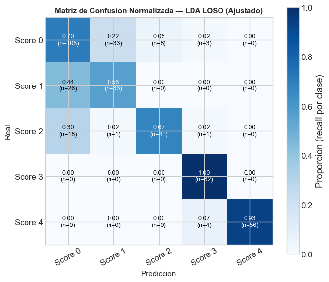

# ✅ Solución: Imágenes No Aparecían

## El Problema

Las imágenes `confusion-pronacion.png` y `confusion-golpeteo.png` no aparecían aunque:
- ✅ Los archivos existían en `assets/`
- ✅ Tenían los nombres correctos
- ✅ Estaban en la ruta correcta

## La Causa

En el HTML, estas imágenes estaban dentro de placeholders (divs) en lugar de estar como etiquetas `` reales:

### ❌ Antes (Placeholder - NO mostraba imagen)
```html
<div class="img-slide" style="padding-top:12px;">
    <div class="img-placeholder" style="min-height:100px;width:100%;">
        <div class="ip-label">Matriz de confusión — Pronación</div>
        <div class="ip-filename">assets/confusion-pronacion.png</div>
    </div>
</div>
```

### ✅ Después (Imagen Real - SÍ muestra imagen)
```html
<div class="img-slide" style="padding-top:12px;">
    
</div>
```

## Cambios Realizados

### ✅ Línea ~751 - Confusión Pronación
- Convertida de placeholder a etiqueta ``
- Ahora renderiza la imagen real

### ✅ Línea ~792 - Confusión Golpeteo
- Convertida de placeholder a etiqueta ``
- Ahora renderiza la imagen real

## Verificación

### Imágenes disponibles en assets/:
- ✅ `confusion-pronacion.png` - **AHORA SE MUESTRA**
- ✅ `confusion-golpeteo.png` - **AHORA SE MUESTRA**
- ✅ `logo-icesi.png`

### Rutas verificadas:
```
assets/
├── confusion-pronacion.png   ✅
├── confusion-golpeteo.png    ✅
├── logo-icesi.png            ✅
├── styles.css
├── presentation.js
└── color-reference.html
```

## Resultado

🎉 Las imágenes ahora **aparecen correctamente** en la presentación:
- Pronación: Slide 22
- Golpeteo: Slide 23

## Próximos Pasos

Si necesitas agregar más imágenes:

1. **Para otros placeholders**: Convierte de la misma forma (de div placeholder a ``)
2. **Asegúrate de usar rutas relativas**: `./assets/nombre.png`
3. **Usa estilos consistentes**:
   ```html
   style="max-width:100%; max-height:XXXpx; border-radius:10px; 
          box-shadow:0 4px 20px rgba(0,0,0,0.08); border:1px solid var(--border);"
   ```

---

**¡Problema resuelto! Las imágenes ya deberían verse ahora.** 🖼️
